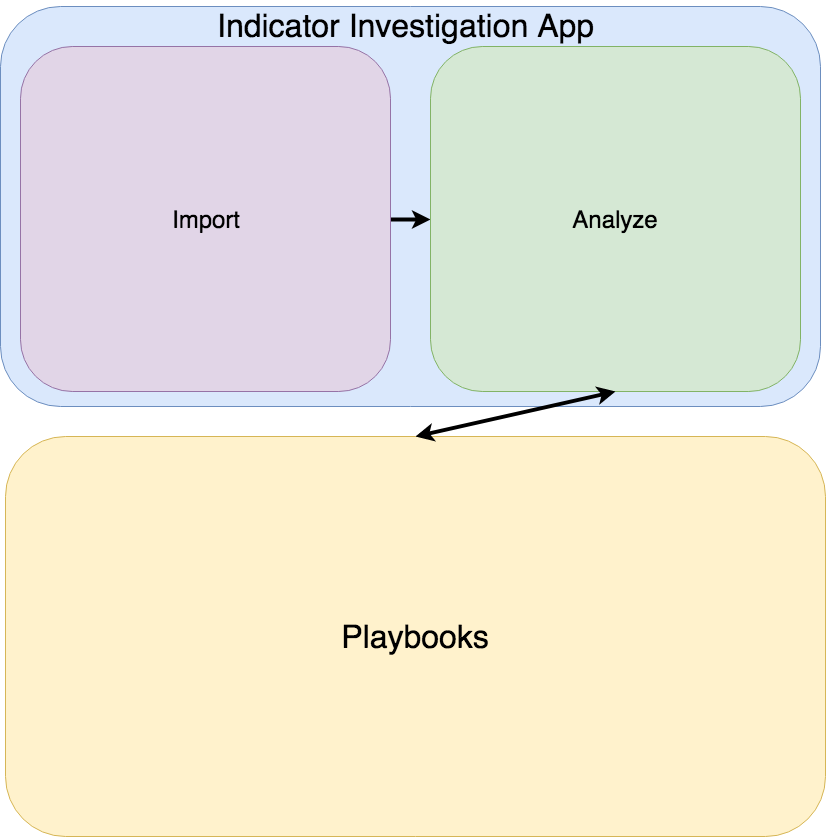

# Mass Investigator

Investigate many indicators of compromise with many tools in one view.

## Getting Started

To get started, the code for the app is in the `src/` folder. To setup your environment for testing, run:

```
make setup
```

## Motivating Problem

The basic idea for this app is pretty simple... as an analyst, I need a way to investigate multiple indicator of compromise in multiple systems. For example, I may have a list of ten domains which I would like to investigate in VirusTotal, DomainTools, and Shodan. Currently, this can be done programmatically in a script, but this solution is not very extensible and is of limited effectiveness for those who are not very familiar with programming. A better solution is to use a system like ThreatConnect's [playbooks](https://threatconnect.com/intelligence-driven-orchestration/) which allow you to chain apps together in a way that is more extensible and approachable to those with very little programming expertise. But even if you have playbooks that submit an indicator to different tools (e.g. VT, DT, Shodan), you still have the challenges of submitting multiple indicators to the playbook at once and viewing the results. This app is designed as a UI for submitting multiple indicators of compromise to multiple tools and displaying the analysis.

## Objectives

This app is designed to submit multiple indicators to multiple tools and present the results in one view. The goal is to provide analysts with a good sense of:

- Whether or not an indicator is malicious
- The data an external tool knows about an indicator
- Which external tools have information about an indicator that is worth further investigation

## App Structure

To achieve the objective, this app has two steps:

1. Indicator import

    This step allows the researcher to provide a plain-text list of indicators he/she would like to investigate.

2. Indicator analysis

    This step allows the researcher to select the external tools he/she would like to use and to submit each indicator to those tools. To submit the indicators to the tools, this app uses playbooks as described [below](#solution-architecture).

## Solution Architecture

The broad architecture of this system is as follows:



## Build App For Release

```
make pack
```

This will package the app as `target/TCS_-_Mass_Investigator.tcx`.

## Build App in Development Mode (does not minify or uglify code, so it can be debugged in browser)

```
make pack-dev
```

## Deploy

In the ThreatConnect UI install the App (the `.tcx` file) created in the [Build App for Release](#build-app-for-release) section.

## Credits

This package was created with [Cookiecutter](https://github.com/audreyr/cookiecutter) and [Floyd Hightower's Spaces App Template](https://github.com/fhightower-templates/threatconnect-angular-spaces-template).
